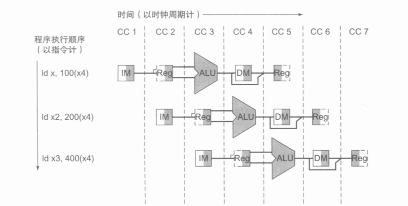

# RV32I CPU

“陛下，我们把这台计算机命名为‘秦一号’。请看，那里，中心部分，是CPU，是计算机的核心计算元件。由您最精锐的五个军团构成，对照这张图您可以看到里面的加法器、寄存器、堆栈存贮器；外围整齐的部分是内存，构建这部分时我们发现人手不够，好在这部分每个单元的动作最简单，就训练每个士兵拿多种颜色的旗帜，组合起来后，一个人就能同时完成最初二十个人的操作，这就使内存容量达到了运行‘秦-1.0’操作系统的最低要求；”

> 

> 
>  《三体》, 刘慈欣
> 
> 

# CPU：状态机

*CPU* 的核心部件有两个，寄存器组和内存。

无穷无尽的指令在 *CPU* 中流过，改变寄存器和内存的值， *CPU* 就是这样简单。

所以我们可以用 *C* 语言来模拟状态机，更好地便于我们调试。

[300行的简单riscv模拟器](https://github.com/Azalea8/riscv_sim)

# RISC-V指令集简介

[RISC-V](https://riscv.org/) 是由 *UC Berkeley* 推出的一套开源指令集。
该指令集包含一系列的基础指令集和可选扩展指令集。在本实验中我们主要关注其中的 *32* 位基础指令集 *RV32I* 。

*RV32I* 指令集中包含了 *40* 条基础指令，涵盖了整数运算、存储器访问、控制转移和系统控制几个大类。本项目中没有实现系统控制的 *ECALL/EBREAK*、内存同步 *FENCE* 指令及 *CSR* 访问指令，所以共实现了 *37* 条指令。

*RV32I* 中的程序计数器 *PC* 及 *32*  个通用寄存器均是 *32* bit，访存地址线宽度也是 *32* 位。*RV32I* 的指令长度也统一为 *32* 位。

### RV32I指令编码

*RV32I* 的指令编码非常规整，分为六种类型，其中四种类型为基础编码类型，其余两种是变种：

> 

> 
> *   **R-Type** ：为寄存器操作数指令，含2个源寄存器rs1 ,rs2和一个目的寄存器 rd。
> 
> *   **I-Type** ：为立即数操作指令，含1个源寄存器和1个目的寄存器和1个12bit立即数操作数
> 
> *   **S-Type** ：为存储器写指令，含2个源寄存器和一个12bit立即数。
> 
> *   **B-Type** ：为跳转指令，实际是 *S-Type* 的变种。与 *S-Type* 主要的区别是立即数编码。
> 
> *   **U-Type** ：为长立即数指令，含一个目的寄存器和20bit立即数操作数。
> 
> *   **J-Type** ：为长跳转指令，实际是 *U-Type* 的变种。与 *U-Type* 主要的区别是立即数编码。
> 

其中四种基本格式如图

在指令编码中，opcode必定为指令低7bit，源寄存器rs1，rs2和目的寄存器rd也都在特定位置出现，所以指令解码非常方便。

### RV32I中的通用寄存器

RV32I共32个32bit的通用寄存器x0~x31(寄存器地址为5bit编码），其中寄存器x0中的内容总是0，无法改变。
其他寄存器的别名和寄存器使用约定参见表。

需要注意的是，部分寄存器在函数调用时是由调用方（Caller）来负责保存的，部分寄存器是由被调用方（Callee）来保存的。在进行C语言和汇编混合编程时需要注意。

<table class="docutils align-default" id="tab-regname">
<caption>Table 12 RV32I中通用寄存器的定义与用法</caption>
<thead>
<tr class="row-odd"><th class="head">

Register
</th>
<th class="head">

Name
</th>
<th class="head">

Use
</th>
<th class="head">

Saver
</th>
</tr>
</thead>
<tbody>
<tr class="row-even"><td>

x0
</td>
<td>

zero
</td>
<td>

Constant 0
</td>
<td>

–
</td>
</tr>
<tr class="row-odd"><td>

x1
</td>
<td>

ra
</td>
<td>

Return Address
</td>
<td>

Caller
</td>
</tr>
<tr class="row-even"><td>

x2
</td>
<td>

sp
</td>
<td>

Stack Pointer
</td>
<td>

Callee
</td>
</tr>
<tr class="row-odd"><td>

x3
</td>
<td>

gp
</td>
<td>

Global Pointer
</td>
<td>

–
</td>
</tr>
<tr class="row-even"><td>

x4
</td>
<td>

tp
</td>
<td>

Thread Pointer
</td>
<td>

–
</td>
</tr>
<tr class="row-odd"><td>

x5~x7
</td>
<td>

t0~t2
</td>
<td>

Temp
</td>
<td>

Caller
</td>
</tr>
<tr class="row-even"><td>

x8
</td>
<td>

s0/fp
</td>
<td>

Saved/Frame pointer
</td>
<td>

Callee
</td>
</tr>
<tr class="row-odd"><td>

x9
</td>
<td>

s1
</td>
<td>

Saved
</td>
<td>

Callee
</td>
</tr>
<tr class="row-even"><td>

x10~x11
</td>
<td>

a0~a1
</td>
<td>

Arguments/Return Value
</td>
<td>

Caller
</td>
</tr>
<tr class="row-odd"><td>

x12~x17
</td>
<td>

a2~a7
</td>
<td>

Arguments
</td>
<td>

Caller
</td>
</tr>
<tr class="row-even"><td>

x18~x27
</td>
<td>

s2~s11
</td>
<td>

Saved
</td>
<td>

Callee
</td>
</tr>
<tr class="row-odd"><td>

x28~x31
</td>
<td>

t3~t6
</td>
<td>

Temp
</td>
<td>

Caller
</td>
</tr>
</tbody>
</table>

### RV32I中的指令类型

本实验中需要实现的RV32I指令含包含以下三类：

*   **整数运算指令** ：可以是对两个源寄存器操作数，或一个寄存器一个立即数操作数进行计算后，结果送入目的寄存器。运算操作包括带符号数和无符号数的算术运算、移位、逻辑操作和比较后置位等。

*   **控制转移指令** ：条件分支包括 *beq* ，*bne* 等等，根据寄存器内容选择是否跳转。无条件跳转指令会将本指令下一条指令地址 *PC+4* 存入 *rd* 中供函数返回时使用。

*   **存储器访问指令** ：对内存操作是首先寄存器加立即数偏移量，以计算结果为地址读取/写入内存。读写时可以是按32位字，16位半字或8位字节来进行读写。读写时区分无符号数和带符号数。注意：RV32I为 [Load/Store](https://en.wikipedia.org/wiki/Load%E2%80%93store_architecture) 型架构，内存中所有数据都需要先 *load* 进入寄存器才能进行操作，不能像 *x86* 一样直接对内存数据进行算术处理。

### 整数运算指令

RV32I的整数运算指令包括21条不同的指令，其指令编码方式参见表

这些整数运算指令所需要完成的操作参见表。

<table class="docutils align-default" id="tab-integerop">
<caption>整数运算指令操作说明</caption>
<thead>
<tr class="row-odd"><th class="head">

指令
</th>
<th class="head">

行为
</th>
</tr>
</thead>
<tbody>
<tr class="row-even"><td>

lui rd,imm20
</td>
<td>

将 20 位的立即数左移12位，低 12 位补零，并写回寄存器 rd 中
</td>
</tr>
<tr class="row-odd"><td>

auipc rd,imm20
</td>
<td>

将 20 位的立即数左移12位，低 12 位补零，将得到的 32 位数与 pc 的值相加，最后写回寄存器 rd 中
</td>
</tr>
<tr class="row-even"><td>

addi rd,rs1,imm12
</td>
<td>

立即数加法
</td>
</tr>
<tr class="row-odd"><td>

slti rd,rs1,imm12
</td>
<td>

立即数有符号小于比较
</td>
</tr>
<tr class="row-even"><td>

sltiu rd,rs1,imm12
</td>
<td>

立即数无符号小于比较
</td>
</tr>
<tr class="row-odd"><td>

xori rd,rs1,imm12
</td>
<td>

立即数逻辑异或
</td>
</tr>
<tr class="row-even"><td>

ori rd,rs1,imm12
</td>
<td>

立即数逻辑或
</td>
</tr>
<tr class="row-odd"><td>

andi rd,rs1,imm12
</td>
<td>

立即数逻辑与
</td>
</tr>
<tr class="row-even"><td>

slli rd,rs1,shamt
</td>
<td>

立即数逻辑左移
</td>
</tr>
<tr class="row-odd"><td>

srli rd,rs1,shamt
</td>
<td>

立即数逻辑右移
</td>
</tr>
<tr class="row-even"><td>

srai rd,rs1,shamt
</td>
<td>

立即数算数右移
</td>
</tr>
<tr class="row-odd"><td>

add rd,rs1,rs2
</td>
<td>

加法
</td>
</tr>
<tr class="row-even"><td>

sub rd,rs1,rs2
</td>
<td>

减法
</td>
</tr>
<tr class="row-odd"><td>

sll rd,rs1,rs2
</td>
<td>

逻辑左移
</td>
</tr>
<tr class="row-even"><td>

slt rd,rs1,rs2
</td>
<td>

有符号小于比较
</td>
</tr>
<tr class="row-odd"><td>

sltu rd,rs1,rs2
</td>
<td>

无符号小于比较
</td>
</tr>
<tr class="row-even"><td>

xor rd,rs1,rs2
</td>
<td>

逻辑异或
</td>
</tr>
<tr class="row-odd"><td>

srl rd,rs1,rs2
</td>
<td>

逻辑右移
</td>
</tr>
<tr class="row-even"><td>

sra rd,rs1,rs2
</td>
<td>

算数右移
</td>
</tr>
<tr class="row-odd"><td>

or rd,rs1,rs2
</td>
<td>

逻辑或
</td>
</tr>
<tr class="row-even"><td>

and rd,rs1,rs2
</td>
<td>

逻辑与
</td>
</tr>
</tbody>
</table>

基本的整数运算指令并没有完全覆盖到所有的运算操作。RV32I中基本指令集可以通过伪指令或组合指令的方式来实现基本指令中未覆盖到的功能，具体可以参考 常见伪指令 节。

### 控制转移指令

RV32I中包含了6条分支指令和2条无条件转移指令。图列出了这些控制转移指令的编码方式。

<table class="docutils align-default" id="tab-branchop">
<caption>控制转移指令操作说明</caption>
<thead>
<tr class="row-odd"><th class="head">

指令
</th>
<th class="head">

行为
</th>
</tr>
</thead>
<tbody>
<tr class="row-even"><td>

jal rd,imm20
</td>
<td>

将 PC+4 的值保存到 rd 寄存器中，然后设置 PC = PC + offset
</td>
</tr>
<tr class="row-odd"><td>

jalr rd,rs1,imm12
</td>
<td>

将 PC+4 保存到 rd 寄存器中，然后设置 PC = rs1  + imm
</td>
</tr>
<tr class="row-even"><td>

beq rs1,rs2,imm12
</td>
<td>

相等跳转
</td>
</tr>
<tr class="row-odd"><td>

bne rs1,rs2,imm12
</td>
<td>

不等跳转
</td>
</tr>
<tr class="row-even"><td>

blt rs1,rs2,imm12
</td>
<td>

小于跳转
</td>
</tr>
<tr class="row-odd"><td>

bge rs1,rs2,imm12
</td>
<td>

大于等于跳转
</td>
</tr>
<tr class="row-even"><td>

bltu rs1,rs2,imm12
</td>
<td>

无符号小于跳转
</td>
</tr>
<tr class="row-odd"><td>

bgeu rs1,rs2,imm12
</td>
<td>

无符号大于等于跳转
</td>
</tr>
</tbody>
</table>

### 存储器访问指令

RV32I提供了按字节、半字和字访问存储器的8条指令。所有访存指令的寻址方式都是寄存器间接寻址方式，访存地址可以不对齐4字节边界，但是在实现中可以要求访存过程中对齐4字节边界。在读取单个字节或半字时，可以按要求对内存数据进行符号扩展或无符号扩展后再存入寄存器。

<table class="docutils align-default" id="tab-memop">
<caption>存储访问指令操作说明</caption>
<thead>
<tr class="row-odd"><th class="head">

指令
</th>
<th class="head">

行为
</th>
</tr>
</thead>
<tbody>
<tr class="row-even"><td>

lb rd,imm12(rs1)
</td>
<td>
字节加载
</td>
</tr>
<tr class="row-odd"><td>

lh rd,imm12(rs1)
</td>
<td>
半字加载
</td>
</tr>
<tr class="row-even"><td>

lw rd,imm12(rs1)
</td>
<td>
字加载
</td>
</tr>
<tr class="row-odd"><td>

lbu rd,imm12(rs1)
</td>
<td>
无符号字节加载
</td>
</tr>
<tr class="row-even"><td>

lhu rd,imm12(rs1)
</td>
<td>
无符号半字加载
</td>
</tr>
<tr class="row-odd"><td>

sb rs2,imm12(rs1)
</td>
<td>
字节储存
</td>
</tr>
<tr class="row-even"><td>

sh rs2,imm12(rs1)
</td>
<td>
半字储存
</td>
</tr>
<tr class="row-odd"><td>

sw rs2,imm12(rs1)
</td>
<td>
字储存
</td>
</tr>
</tbody>
</table>
</section>
<section id="id7">

### 常见伪指令

RISC-V中规定了一些常用的伪指令。这些伪指令一般可以在汇编程序中使用，汇编器会将其转换成对应的指令序列。表介绍了RISC-V的常见伪指令列表。

<table class="docutils align-default" id="tab-pseudocode">
<caption>常见伪指令说明</caption>
<thead>
<tr class="row-odd"><th class="head">

伪指令
</th>
<th class="head">

实际指令序列
</th>
<th class="head">

操作
</th>
</tr>
</thead>
<tbody>
<tr class="row-even"><td>

nop
</td>
<td>

addi x0, x0, 0
</td>
<td>

空操作
</td>
</tr>
<tr class="row-odd"><td>

li rd,imm
</td>
<td>

lui rd, imm[32:12]+imm[11]

addi rd, rd, imm[11:0]

</td>
<td>

加载32位立即数，先加载高位，

再加上低位，注意低位是符号扩展

</td>
</tr>
<tr class="row-even"><td>

mv rd, rs
</td>
<td>

addi rd, rs
</td>
<td>

寄存器拷贝
</td>
</tr>
<tr class="row-odd"><td>

not rd, rs
</td>
<td>

xori rd, rs, -1
</td>
<td>

取反操作
</td>
</tr>
<tr class="row-even"><td>

neg rd, rs
</td>
<td>

sub  rd, x0, rs
</td>
<td>

取负操作
</td>
</tr>
<tr class="row-odd"><td>

seqz rd, rs
</td>
<td>

sltiu rd, rs, 1
</td>
<td>

等于0时置位
</td>
</tr>
<tr class="row-even"><td>

snez rd, rs
</td>
<td>

sltu rd, x0, rs
</td>
<td>

不等于0时置位
</td>
</tr>
<tr class="row-odd"><td>

sltz rd, rs
</td>
<td>

slt rd, rs, x0
</td>
<td>

小于0时置位
</td>
</tr>
<tr class="row-even"><td>

sgtz rd, rs
</td>
<td>

slt rd, x0, rs
</td>
<td>

大于0时置位
</td>
</tr>
<tr class="row-odd"><td>

beqz rs, offset
</td>
<td>

beq rs, x0, offset
</td>
<td>

等于0时跳转
</td>
</tr>
<tr class="row-even"><td>

bnez rs, offset
</td>
<td>

bne rs, x0, offset
</td>
<td>

不等于0时跳转
</td>
</tr>
<tr class="row-odd"><td>

blez rs, offset
</td>
<td>

bge x0, rs, offset
</td>
<td>

小于等于0时跳转
</td>
</tr>
<tr class="row-even"><td>

bgez rs, offset
</td>
<td>

bge rs, x0, offset
</td>
<td>

大于等于0时跳转
</td>
</tr>
<tr class="row-odd"><td>

bltz rs, offset
</td>
<td>

blt rs, x0, offset
</td>
<td>

小于0时跳转
</td>
</tr>
<tr class="row-even"><td>

bgtz rs, offset
</td>
<td>

blt x0, rs, offset
</td>
<td>

大于0时跳转
</td>
</tr>
<tr class="row-odd"><td>

bgt rs, rt, offset
</td>
<td>

blt rt, rs, offset
</td>
<td>

rs大于rt时跳转
</td>
</tr>
<tr class="row-even"><td>

ble rs, rt, offset
</td>
<td>

bge rt, rs, offset
</td>
<td>

rs小于等于rt时跳转
</td>
</tr>
<tr class="row-odd"><td>

bgtu rs, rt, offset
</td>
<td>

bltu rt, rs, offset
</td>
<td>

无符号rs大于rt时跳转
</td>
</tr>
<tr class="row-even"><td>

bleu rs, rt, offset
</td>
<td>

bgeu rt, rs, offset
</td>
<td>

无符号rs小于等于rt时跳转
</td>
</tr>
<tr class="row-odd"><td>

j offset
</td>
<td>

jal x0, offset
</td>
<td>

无条件跳转，不保存地址
</td>
</tr>
<tr class="row-even"><td>

jal offset
</td>
<td>

jal x1, offset
</td>
<td>

无条件跳转，地址缺省保存在x1
</td>
</tr>
<tr class="row-odd"><td>

jr rs
</td>
<td>

jalr x0, 0 (rs)
</td>
<td>

无条件跳转到rs寄存器，不保存地址
</td>
</tr>
<tr class="row-even"><td>

jalr rs
</td>
<td>

jalr x1, 0 (rs)
</td>
<td>

无条件跳转到rs寄存器，地址缺省保存在x1
</td>
</tr>
<tr class="row-odd"><td>

ret
</td>
<td>

jalr x0, 0 (x1)
</td>
<td>

函数调用返回
</td>
</tr>
<tr class="row-even"><td>

call offset
</td>
<td>

aupic x1, offset[32:12]+offset[11]

jalr x1, offset[11:0] (x1)

</td>
<td>

调用远程子函数
</td>
</tr>
<tr class="row-odd"><td>

la rd, symbol
</td>
<td>

aupic rd, delta[32:12]+delta[11]

addi rd, rd, delta[11:0]

</td>
<td>

载入全局地址，其中detla是PC和全局符号地址的差
</td>
</tr>
<tr class="row-even"><td>

lla rd, symbol
</td>
<td>

aupic rd, delta[32:12]+delta[11]

addi rd, rd, delta[11:0]

</td>
<td>

载入局部地址，其中detla是PC和局部符号地址的差
</td>
</tr>
<tr class="row-odd"><td>

l{b|h|w} rd, symbol
</td>
<td>

aupic rd, delta[32:12]+delta[11]

l{b|h|w} rd, delta[11:0] (rd)

</td>
<td>

载入全局变量
</td>
</tr>
<tr class="row-even"><td>

s{b|h|w} rd, symbol, rt
</td>
<td>

aupic rd, delta[32:12]+delta[11]

s{b|h|w} rd, delta[11:0] (rt)

</td>
<td>

载入局部变量
</td>
</tr>
</tbody>
</table>
</section>
</section>
<section id="id8">

# 单周期电路设计

在了解了RV32I指令集的指令体系结构（Instruction Set Architecture，ISA)之后，我们将着手设计CPU的微架构（micro architecture）。

同样的一套指令体系结构可以用完全不同的微架构来实现。不同的微架构在实现的时候只要保证程序员可见的状态，即PC、通用寄存器和内存等，在指令执行过程中遵守ISA中的规定即可。具体微架构的实现可以自由发挥。

在本实验中，我们首先来实现单周期CPU的微架构。所谓单周期CPU是指CPU在每一个时钟周期中需要完成一条指令的所有操作，即每个时钟周期完成一条指令。

每条指令的执行过程一般需要以下几个步骤：

> 

> 
> 1.  **取指** ：使用本周期新的PC从指令存储器中取出指令，并将其放入指令寄存器（IR）中
> 
> 2.  **译码** ：对取出的指令进行分析，生成本周期执行指令所需的控制信号，并计算下一条指令的地址，从寄存器堆中读取寄存器操作数，并完成立即数的生成
> 
> 
> 3.  **运算** ：利用ALU对操作数进行必要的运算
> 
> 4.  **访存** ：包括读取或写入内存对应地址的内容
> 
> 5.  **写回** ：将最终结果写回到目的寄存器中
> 

**每条指令逻辑上是分为 *5* 个阶段执行，但实际上在一个时钟周期，这 *5* 个步骤是同时发生的。**

每条指令执行过程中的以上几个步骤需要CPU的控制通路和数据通路配合来完成。

其中控制通路主要负责控制信号的生成，通过控制信号来指示数据通路完成具体的数据操作。
数据通路是具体完成数据存取、运算的部件。

控制通路和数据通路分离的开发模式在数字系统中经常可以碰到。其设计的基本指导原则是：控制通路要足够灵活，并能够方便地修改和添加功能，控制通路的性能和时延往往不是优化重点。

反过来，数据通路需要简单且性能强大。数据通路需要以可靠的方案，快速地移动和操作大量数据。
在一个简单且性能强大的数据通路支持下，控制通路可以灵活地通过控制信号的组合来实现各种不同的应用。

图提供了RV32I单周期CPU的参考设计。下面我们就针对该CPU的控制通路和数据通路来分别进行说明 

**有改动的地方，仅作大致参考**

## PC生成

程序计数器 *PC* 控制了整个 *CPU* 指令执行的顺序。在顺序执行的条件下，下一周期的 *PC* 为本周期 *PC+4* 。如果发生跳转，PC将会变成跳转目标地址。

本设计中每个时钟周期是以时钟信号 *CLK* 的上升沿为起点的。在上一周期结束前，利用组合逻辑电路生成本周期将要执行的指令的地址 *NextPC* 。

在时钟上升沿到达时，将 *NextPC* 同时加载到 *PC* 寄存器和指令存储器的地址缓冲中去，完成本周期指令执行的第一步。

*NextPC* 的计算涉及到指令译码和跳转分析，后续在 **跳转控制** 节中会详细描述。

在系统 *reset* 或刚刚上电时，可以将 *PC* 设置为固定的地址，如全零，让系统从特定的启动代码开始执行。

## 指令存储器

指令寄存器 *Instruction Memory* 专门用来存放指令。虽然在冯诺伊曼结构中指令和数据是存放在统一的存储器中，但大多数现代 *CPU* 是将指令缓存和数据缓存分开的。在本实验中我们也将指令和数据分开存储。

本实验中的指令存储器类似 *CPU* 中的指令缓存。本设计采用时钟上升沿来对指令存储器进行读取操作，指令存储器的读取地址是 *PC*。

指令存储器只需要支持读操作，由于指令存储器每次总是读取 *4* 个字节，所以可以将存储器的每个单元大小设置为 *32bit*。

## 指令译码及立即数生成

在读取出本周期的指令 *instr[31:0]* 之后，*CPU* 将对 *32bit* 的指令进行译码，并产生各个指令对应的立即数。

RV32I的指令比较规整，所以可以直接取指令对应的bit做为译码结果：

<pre>assign  op  = instr[6:0];
assign  rs1 = instr[19:15];
assign  rs2 = instr[24:20];
assign  rd  = instr[11:7];
assign  func3  = instr[14:12];
assign  func7  = instr[31:25];
</pre>

同样的，也可以利用立即数生成器 *imm Generator* 生成所有的立即数。注意，所有立即数均是符号扩展，且符号位总是 *instr[31]* :

<pre>assign immI = {{20{instr[31]}}, instr[31:20]};
assign immU = {instr[31:12], 12&#39;b0};
assign immS = {{20{instr[31]}}, instr[31:25], instr[11:7]};
assign immB = {{20{instr[31]}}, instr[7], instr[30:25], instr[11:8], 1&#39;b0};
assign immJ = {{12{instr[31]}}, instr[19:12], instr[20], instr[30:21], 1&#39;b0};
</pre>

在生成各类指令的立即数之后，根据控制信号 *ExtOP* ，通过多路选择器来选择立即数生成器最终输出的 *imm* 是以上五种类型中的哪一个。

<table class="docutils align-default" id="tab-extop">
<caption>控制信号ExtOP的含义</caption>
<thead>
<tr class="row-odd"><th class="head">

ExtOP
</th>
<th class="head">

立即数类型
</th>
</tr>
</thead>
<tbody>
<tr class="row-even"><td>

000
</td>
<td>

immI
</td>
</tr>
<tr class="row-odd"><td>

001
</td>
<td>

immU
</td>
</tr>
<tr class="row-even"><td>

010
</td>
<td>

immS
</td>
</tr>
<tr class="row-odd"><td>

011
</td>
<td>

immB
</td>
</tr>
<tr class="row-even"><td>

100
</td>
<td>

immJ
</td>
</tr>
</tbody>
</table>

## 控制信号生成

在确定指令类型后，需要生成每个指令对应的控制信号，来控制数据通路部件进行对应的动作。控制信号生产部件 *Control Signal Generator* 是根据 *instr* 中的操作码 *opcode* ，及 *func3* 和 *func7* 来生成对应的控制信号的。

生成的控制信号具体包括：

*   **extOP** :宽度为3bit，选择立即数产生器的输出类型。

*   **write_reg** ：宽度为1bit，控制是否对寄存器rd进行写回，为1时写回寄存器。

*   **rs1Data_EX_PC** ：宽度为1bit，选择ALU输入端A的来源。为0时选择rs1，为1时选择PC。

*   **rs2Data_EX_imm32_4** ：宽度为2bit，选择ALU输入端B的来源。为00时选择rs2，为01时选择imm(当是立即数移位指令时，只有低5位有效)，为10时选择常数4（用于跳转时计算返回地址PC+4）。

*   **aluc** ：宽度为5bit，选择ALU执行的操作。

*   **pcImm_NEXTPC_rs1Imm** ：宽度为2bit，无条件跳转信号，01时选择pc + imm，10时选择rs1Data + imm。

*   **aluOut_WB_memOut** ：宽度为1bit，选择寄存器rd写回数据来源，为0时选择ALU输出，为1时选择数据存储器输出。

*   **write_mem** ：宽度为2bit，控制是否对数据存储器进行写入，为01时按字写回存储器，10时按半字写回存储器，11时按字节写回存储器。

*   **read_mem** ：宽度为3bit，控制数据存储器读格式。最高位为1时带符号读，为0时无符号读。低二位为00时直接返回32'b0，为01时为4字节读（无需判断符号），为10时为2字节读，为11时为1字节读。

这些控制信号控制各个数据通路部件按指令的要求进行对应的操作。

根据这些控制信号可以得出系统在给定指令下的一个周期内所需要做的具体操作。

如果没有学习过组成原理的同学请参考相关教科书，分析各类指令在给定控制信号下的数据通路的具体操作。这里只进行一个简略的说明：

*   **lui** : ALU A输入端不用，B输入端为立即数，按U-Type扩展，ALU执行的操作是拷贝B输入，ALU结果写回到rd。

*   **auipc** ：ALU A输入端为PC，B输入端为立即数，按U-Type扩展，ALU执行的操作是加法，ALU结果写回到rd。

*   **立即数运算类指令** ：ALU A输入端为rs1，B输入端为立即数，按I-Type扩展。ALU按ALUctr进行操作，ALU结果写回rd。

*   **寄存器运算类指令** ：ALU A输入端为rs1，B输入端为rs2。ALU按ALUctr进行操作，ALU结果写回rd。

*   **jal** : ALU A输入端PC，B输入端为常数4，ALU执行的操作是计算PC+4，ALU结果写回到rd。PC计算通过专用加法器，计算PC+imm，imm为J-Type扩展。

*   **jalr** : ALU A输入端PC，B输入端为常数4，ALU执行的操作是计算PC+4，ALU结果写回到rd。PC计算通过专用加法器，计算rs1+imm，imm为I-Type扩展。

*   **Branch类指令** : ALU A输入端为rs1，B输入端为rs2，ALU执行的操作是比较大小或判零，根据ALU标志位选择NextPC，可能是PC+4或PC+imm，imm为B-Type扩展，PC计算由专用加法器完成。不写回寄存器。

*   **Load类指令** :ALU A输入端为rs1，B输入端为立即数，按I-Type扩展。ALU做加法计算地址，读取内存，读取内存方式由存储器具体执行，内存输出写回rd。

*   **Store类指令** :ALU A输入端为rs1，B输入端为立即数，按S-Type扩展。ALU做加法计算地址，将rs2内容写入内存，不写回寄存器。
</section>
<section id="id14">

## NextPC

代码执行过程中，NextPC可能会有多种可能性：

> 

> 
> *   顺序执行：NextPC = PC + 4；
> 
> *   jal： NextPC = PC + imm;
> 
> *   jalr： NextPC = rs1Data + imm;
> 
> *   条件跳转： 根据ALU的condition_branch来判断，NextPC可能是PC + 4或者 PC + imm；
> 

这里就直接贴出跳转的代码

    module next_pc(
    input [1: 0] pcImm_NEXTPC_rs1Imm,
    input condition_branch,
    input [31: 0] pc, offset, rs1Data,

    output reg [31: 0] next_pc
    );

    always @(*) begin
        if(pcImm_NEXTPC_rs1Imm == 2'b01) next_pc = pc + offset;
        else if(pcImm_NEXTPC_rs1Imm == 2'b10) next_pc = rs1Data + offset;
        else if(condition_branch) next_pc = pc + offset;
        else if(pc == 32'h6c) next_pc = 32'h6c; // CPU空转
        else next_pc = pc + 4;
    end

    endmodule

可以发现其中的 *condition_branch* 信号不是由控制器给出，因为条件分支是否要跳转是要由 *ALU* 给出

## 寄存器堆

寄存器堆是CPU中用于存放指令执行过程中临时数据的存储单元。
我们将要实现的RISC-V的基础版本CPU RV32I具有32个寄存器。
RV32I采用 [Load Store](https://en.wikipedia.org/wiki/Load%E2%80%93store_architecture) 架构，即所有数据都需要先用Load语句从内存中读取到寄存器里才可以进行算术和逻辑操作。
因此，RV32I有32个通用寄存器，且每条算术运算可能要同时读取两个源寄存器并写入一个目标寄存器。

RV32I共32个32bit的通用寄存器x0~x31（寄存器地址为5bit编码），其中寄存器x0中的内容总是0，无法改变。

描述了寄存器堆的接口，该寄存器堆中有32个32bit的寄存器。

寄存器堆需要支持同时两个读操作和一个写操作。因此需要有2个读地址Ra和Rb，分别对应RISC-V汇编中的rs1和rs2。写地址为Rw，对应rd。地址均是5位。

写入数据busW为32位，写入有效控制为一位高电平有效的RegWr信号。
寄存器堆的输出是2个32位的寄存器数据，分别是busA和busB。
寄存器堆有一个控制写入的时钟WrClk。

在时序上我们可以让读取是非同步的，即地址改变立刻输出。写入可以在时钟下降沿写入。

这里注意如果同时读取和写入同一个寄存器，我们默认是读取的旧值.

注意，寄存器 *x0* 需要特殊处理，不论何时都是全零。

## ALU

ALU是CPU中的核心数据通路部件之一，它主要完成CPU中需要进行的算术逻辑运算。

这里直接贴出ALU的代码

    module alu(
    input[4: 0] aluc,
    input [31: 0] a, b,

    output reg [31: 0] out, 
    output reg condition_branch
    );

    always @(*) begin
        condition_branch = 0;
        out = 32'b0;
        case (aluc)
            5'b00000: out = a + b;
            5'b00001: out = a - b;
            5'b00010: out = a & b;
            5'b00011: out = a | b;
            5'b00100: out = a ^ b;
            5'b00101: out = a << b;
            5'b00110: out = ($signed(a) < ($signed(b))) ? 32'b1 : 32'b0;
            5'b00111: out = (a < b) ? 32'b1 : 32'b0;
            5'b01000: out = a >> b;
            5'b01001: out = ($signed(a)) >>> b;
            5'b01010: begin 
                out = a + b;
                out[0] = 1'b0;
            end
            5'b01011: condition_branch = (a == b) ? 1'b1 : 1'b0;
            5'b01100: condition_branch = (a != b) ? 1'b1 : 1'b0;
            5'b01101: condition_branch = ($signed(a) < $signed(b)) ? 1'b1 : 1'b0;
            5'b01110: condition_branch = ($signed(a) >= $signed(b)) ? 1'b1 : 1'b0;
            5'b01111: condition_branch = (a < b) ? 1'b1: 1'b0;
            5'b10000: condition_branch = (a >= b) ? 1'b1: 1'b0;
            default: out = 32'b0;
        endcase
    end

    endmodule

## 数据存储器

数据存储器在 *CPU* 运行中存储全局变量、堆栈等数据。我们建议大家实现至少 *128* kB大小的数据存储器容量。

并且，该数据存储器需要支持在沿上进行读取和写入操作。*RV32I* 的字长是 *32* bit，但是，数据存储器不仅要支持 *32* bit数据的存取，同时也需要支持按字节（ *8* bit）或半字（ *16* bit）大小的读取。

## 单周期CPU的时序设计

在单周期 *CPU* 中，所有操作均需要在一个周期内完成。其中单周期存储部件的读写是时序设计的关键。在 *CPU* 架构中 *PC* 、寄存器堆，指令存储器和数据存储器都是状态部件，需要用寄存器或存储器来实现。

对指令存储器和数据存储器来说，一般系统至少需要数百KB的容量。此时建议用时钟沿来控制读写。假定我们是以时钟上升延为每个时钟周期的开始。对于存储器和寄存器的写入统一安排在上升沿上进行。

> 

> 
> *   周期开始的上升沿将 *next_pc* 写入 *PC* 寄存器，*pc* 读取指令存储器。
> 
> *   指令读出后将出现在指令存储器的输出端，该信号可以通过组合逻辑来进行指令译码，产生控制信号，寄存器读写地址及立即数等。
> 
> *   寄存器读地址产生后，直接通过非同步读取方式，读取两个源寄存器的数据，与立即数操作数一起准备好，进入ALU的输入端。
> 
> *   ALU也是组合逻辑电路，在输入端数据准备好后就开始运算。
> 
> *   数据存储器的读地址如果准备好了，就可以在上升沿进行内存读取操作。
> 
> *   最后，同时对目的寄存器和数据存储器进行写入操作。这样下一周期这些存储器中的数据就是最新的了。
> 

## 模块化设计

CPU设计过程中需要多个不同的模块分工协作，建议在开始编码前划分好具体模块的功能和接口。对于模块划分提供了以下的参考建议。

*   **CPU模块** ：顶层模块，主要对外接口包括时钟、Reset、指令存储器的地址/数据线、数据存储器的地址及数据线和自行设计的调试信号。

    *   **PC模块** ：当前指令地址

    *   **NextPC模块** : 给出下一个指令地址

    *   **指令存储器模块** ：主要对外接口包括时钟、地址线和输出数据线。

    *   **ID模块** ：对指令译码

    *   **控制信号生成模块** ：主要对外接口是指令输入及各种控制信号输出。

    *   **寄存器堆模块** ：主要对外接口是读写寄存器号输入、写入数据输入、寄存器控制信号、写入时钟、输出数据。

    *   **立即数生成器模块** ：主要对外接口是指令输入，立即数类型及立即数输出。

    *   **二路选择器** ： 控制信号来选择输出

    *   **三路选择器** ：控制信号来选择输出

    *   **ALU模块** : 主要对外接口是ALU的输入操作数、ALU控制字、ALU结果输出和标志位输出等。

    *   **数据存储器模块** ：主要对外接口包括时钟、输入输出地址线、输入输出数据、内存访问控制信号和写使能信号。

设计时请先划分模块，确认模块的连接，再单独开发各个模块，建议对模块进行单元测试后再整合系统。

# 五级流水线电路设计

## 概述

从这里开始，我们将尝试设计五级流水线的CPU。

尽管单周期可以正确工作，但是在现代设计中不采取这种方式，因为它的效率实在太低。究其原因，是在单周期设计中时钟周期必须等长。这样处理器中最长的路径决定了时钟周期，这也叫关键路径。这条路径很可能是一条 *load* 指令，他连续使用5个功能单元，指令存储器，寄存器堆，AU，数据存储器和寄存器堆。虽然每个周期仍然能执行一条指令，但由于时钟周期太长，单周期实现的整体性能可能很差

流水线是一种能使多条指令重叠执行的实现技术，目前流水线技术广泛应用。

流水线的矛盾在于，对于一条指令，取指，译码，执行，访存，写回的时间在流水线中并没有缩短，反而增大了。然而对于许多指令来说，流水线更快的原因是所有的工作都在并行的执行。所以单位时间可以完成更多的工作，流水线提高了系统的吞吐率。因此流水线不会缩短一条指令执行的时间，但当有许多条指令需要执行时，吞吐率的提高减少了整个任务的时间

RISC-V指令执行通常包含5个步骤：

* 从指令储存器中取出指令

* 译码指令并读寄存器

* 执行操作并计算地址

* 访问数据存储器（如有必要）

* 将结果写入寄存器（如有必要）

因此，我们的流水线共有五级

流水线技术是一种在顺序指令流中开发指令间并行性的技术。与多处理器编程的优点是它对程序员来说是不可见的

## 基本的流水线

将指令划分成五个阶段意味着五级流水线，还意味着在任意周期里最多执行五条有用的指令。实际上任意周期都会执行五条指令，比如最开始的时候，虽然只有取指阶段正常工作，其余阶段待机，但并不意味着其余阶段什么也不做，它们会执行 *nop* 指令，这条指令的含义是什么也不做。

我们将数据通路划分成五个部分，每个部分用对应的指令执行阶段来命名：

* IF : 取指

* ID : 译码

* EX : 执行

* ME : 访存

* WB : 写回

指令和数据通常随着执行过程从到右依次通过这五个阶段，同时永远不会逆向移动。然而，在从左到右的指令流动过程中存在两个特殊情况：

* 在写回阶段，它将结果写回位于数据通路中译码阶段的寄存器堆中。

* 在选择下一PC值时，在自增PC值和ME阶段的分支地址之间做选择

从右到左的数据流向不会对当前指令产生影响，这种逆向的移动只会影响后续的指令执行。需要注意的是，第一种特殊情况会导致 **数据冒险**，第二种会导致 **控制冒险**。

似乎表明三条指令需要三条独立的数据通路，但事实上，我们可以通过引入寄存器保护数据的方式，来分割数据通路。就像，我们在每两个步骤之间放一个篮子来存放下个阶段所需的数据

当然每条指令都会更新PC，无论是通过自增还是通过将其设置为分支目标地址。PC可以被看作一个流水线寄存器：它给流水线的IF阶段提供数据。不同于图中被标记阴影的流水线寄存器，PC是可见体系结构状态的一部分，在发生例外时，PC中的内容必须被保存，而流水线寄存器中的内容则可以被丢弃。（我们的CPU不涉及中断和异常，因为没有操作系统）

每个阶段所需的数据和控制信号都从流水线寄存器中取得，再将结果送往下个阶段的流水线寄存器。

## 解决数据冒险的流水线

### 前递
上一节展示了流水线的强大功能以及硬件如何通过流水线的方式执行任务。现在从一个更实际的例子出发，看看在程序真正执行的时候会发生什么。

    sub x2, x1, x3
    and x12, x2, x5
    or x13, x6, x2
    add x14, x2, x2
    sw x15, 100(x2)

后四条指令（and、or、add、sw）都相关于第一条指令 *sub* 中得到的存放在寄存器 *x2* 中的结果。假设寄存器 *x2* 在 *sub* 指令执行之前的值为 *10* ，在执行之后值为 *-20* ，那么程序员希望在后续指令中引用寄存器 *x2* 时得到的值为 *-20* 。

使用简化的数据通路表示具有相关性的五条指令序列中的流水线相关关系。所有的相关操作在图中都以灰线显示，图中顶部的 *CC1* 表示第一个时钟周期。第一条指令向 *x2* 中写入数据，后续的指令都是从 *x2* 中读取数据。*x2* 寄存器在第五个时钟周期时才被写入，因此在第五个时钟周期前正确的寄存器值是不可用的。从数据通路顶部到底部的灰色线表示相关关系。那些导致时间后退的相关就是流水线数据冒险

*CC5* 对同一个寄存器同时读又同时写，这属于是结构冒险，我们需要自己规定这种时候该如何处理。我们规定读操作会得到本周期被写入的值。这种假定与很多寄存器的实现是一致的，在这种情况下不会发生数据冒险

如图所示，在第五个时钟周期之前，对寄存器 *x2* 的读操作并不能返回 *sub* 指令的结果。因此，图中的 *add* 和 *sw* 指令可以得到正确结果 *-20* ,但是 *and* 和 *or* 指令却会得到错误的结果 *-10*。

在第三个时钟周期，也就是 *sub* 指令的 *EX* 阶段结束时就可以得到想要的结果。那么在 *and* 和 *or* 指令中是什么时候才真正需要这个数据呢?答案是在 *and* 和 *or* 指令的 *EX* 阶段开始的时候，分别对应第四和第五个时钟周期。因此，只要可以一得到相应的数据就将其前递给等待该数据的单元，而不是等待其可以从寄存器堆中读取出来，就可以不需要停顿地执行这段指令了。

这意味着，当一个指令试图在 *EX* 阶段使用的寄存器是一个较早的指令在 *WB* 或者 *ME* 阶段要写入的寄存器时，我们需要将写回的数据作为读寄存器值数据的修正。

可以得到两对冒险的条件：

    la. EX/MEM.RegisterRd = ID/EX.RegisterRs1
    1b. EX/MEM.RegisterRd = ID/EX.RegisterRs2

    2a. MEM/WB.RegisterRd = ID/EX.RegisterRs1
    2b. MEM/WB.RegisterRd = ID/EX.RegisterRs2

因为并不是所有的指令都会写回寄存器，所以这个策略是不正确的，它有时会在不应该前递的时候也将数据前递出去。一种简单的解决方案是检查 *RegWrite* 信号是否是有效的:检查流水线寄存器在 *ME* 和 *WB* 阶段确定 *RegWrite* 信号是否有效。回忆一下，*RISC-V* 要求每次使用 *x0* 寄存器作为操作数时必须认为该操作值为0。如果流水线中的指令以 *x0* 作为目标寄存器，我们希望避免前递非零作为目标寄存器的情况。只要我们将 *EX/MEM.RegisterRd≠0* 添加到第一类冒险条件，并将 *MEM/WB.RegisterRd≠0* 添加到第二类冒险条件中，就可以使得上述条件正常工作。

如果我们可以从任何流水线寄存器而不仅仅是 *id_ex* 流水线寄存器中得到 *ALU* 的输人，那就可以前递正确的数据。通过在 *ALU* 的输人上添加多选器再辅以适当的控制，就可以在存在数据冒险的情况下全速运行流水线。

在加入前递机制之前， *id_ex* 无需保存 *rs1* 和 *rs2* ，但由于前递机制的需要，现在需要保存 *rs1* 和 *rs2* 添加到 *id_ex* 流水线寄存器中。

一种复杂的潜在数据冒险是在 *WB* 阶段指令的结果， *ME* 阶段指令的结果和 *ALU* 阶段指令的源操作数之间发生的。

例如：

    add x1, x1, x2
    add x1, x1, x3
    add x1, x1, x4
    ...

在这种情况下，结果应该是来自 *ME* 阶段前递的数据，因为 *ME* 阶段的结果就是最近的结果。因此， *EX/MEM.RegisterRd* 的优先级要高于 *MEM/WB.RegisterRd*

考虑加载指令紧跟存储指令的情况， *sw* 指令在 *ME* 阶段所需要的数据也就是 *rs2Data* 会及时保存在 *lw* 指令的 *me_wb* 寄存器中。为了实现这个操作也需要在 *ME* 阶段加入前递。

### 停顿

当一条指令试图在加载指令写入一个寄存器之后读取这个寄存器时，前递无法解决此处的冒险，此时流水线必须被阻塞以消除这种指令组合带来的冒险。

因此，除了一个前递单元外，还需要一个冒险检测单元。该单元在 *ID* 流水线阶段操作，从而可以在加载指令和相关加载指令结果的指令之间加入一个流水线阻塞。这个单元检测加载指令，冒险控制单元的控制逻辑满足如下条件:

    if ( ID/EX. MemRead and ((ID/EX.RegisterRd = IF/ID.RegisterRs1) or (ID/EX.RegisterRd = IF/ID. RegisterRs2)))
        stall the pipeline

如果条件成立，指令会停顿一个周期。在一个周期后，前递逻辑就可以处理这个相关并继续执行（如果没有前递，那么还需要再停顿一个时钟周期）

如果处于 *ID* 阶段的指令被停顿了，那么在 *IF* 阶段中的指令也一定要被停顿，否则已经取到的指令就会丢失。只需要简单地禁止 *PC* 寄存器和 *id_id* 流水线寄存器的改变就可以阻止这两条指令的执行。如果这些寄存器被保护，在 *IF* 阶段的指令就会继续使用相同的 *PC* 值取指令，同时在 *ID* 阶段的寄存器就会继续使用 *id_id* 流水线寄存器中相同的字段读寄存器。

我的经验是不要横着看，竖着看。重点关注某一个时钟周期的各个阶段的指令。

流水线控制图概览，图中包括两个前递多选器、一个冒险检测单元和-一个前递单元。尽管简化了 *ID* 和 *EX* 阶段(图中省略了符号扩展立即数和分支逻辑)，但是本图还是说明了前递所需的最基本的硬件。
## 解决控制冒险的流水线

迄今为止，我们只将对冒险的关注局限在算术操作和数据传输中。然而，流水线冒险也包括条件分支。图4-59中画出了一个指令序列，并标明在这个流水线中分支是何时发生的。每个时钟周期都必须进行取值操作以维持流水线，不过在我们的设节中所述，这种为了决定正确执行指令所产生的延迟被称为控制冒险中所述，这种为了决定正确执行指令所产生的延迟被称为控制冒险或分支冒险，这与我们之前讨论的数据冒险相对应。

分支指令对流水线的影响。指令左边的数字(40、44等)代表指令的地址。因为分支指令在 *ME* 阶段决定是否跳转(也就是图中 *beq* 指令在第4个时钟周期内的操作)，分支指令后续的三条指令都将被取值并且开始执行。如果不进行干预，这三条后续指令会在 *beq* 指令跳转到地址72上的 *lw* 指令之前就开始执行。

本节关于控制冒险的篇幅会短于之前叙述数据冒险的小节。这是因为控制冒险相对更好理解。发生的频率也比数据冒险更低，而且相对于数据冒险，现在还没有解决控制冒险的有效手段，我们采用了更简单的描述方案。

### 假设分支不发生

阻塞流水线直到分支完成的策略非常耗时。一种提升分支阻塞效率的方法是预测条件分支不发生并持续执行顺序指令流。一旦条件分支发生，已经被读取和译码的指令就将被丢弃，流水线继续从分支目标处开始执行。如果条件分支不发生的概率是50%，同时丢弃指令的代价又很小，那么这种优化方式可以减少一半由控制冒险带来的代价。

丢弃指令，意味着我们必须要将流水线中 *IF*，*ID*，*EX* 阶段的指令都清除。

### 缩短分支延迟

一种提升条件分支性能的方式是减少发生分支时所需的代价。到目前为止，我们假定分支所需的下一 *PC* 值在 *ME* 阶段才能被获取，但如果我们将流水线中的条件分支指令提早移动执行，就可以刷新更少的指令。要将分支决定向前移动，需要两个操作提早发生:计算分支目标地址和判断分支条件。其中，将分支地址提前进行计算是相对简单的。在 *if_id* 流水线寄存器中已经得到了 *PC* 值和立即数字段，所以只需将分支地址从 *EX* 阶段移动到 *ID* 阶段即可。当然，分支地址的目标计算将会在所有指令中都执行，但只有在需要时才会被使用。

困难的部分是分支决定本身。对于相等时跳转指令，需要在 *ID* 阶段比较两个寄存器中的值是否相等。相等的判断方法可以是先将相应位进行异或操作，再对结果按位进行或操作。将分支检测移动到 *ID* 阶段还需要额外的前递和冒险检测硬件，因为分支可能依赖还在流水线中的结果，在优化后依然要保证运行正确。例如，为了实现相等时跳转指令(或者不等时跳转指令)，需要在 *ID* 阶段将结果前递给相等测试逻辑。这里存在复杂的因素:

因为存在寄存器中数据比较，有关寄存器的就会存在数据冒险。需要在 *id* 阶段额外加入前递和停顿

尽管这很困难，但是将条件分支的执行移动到 *ID* 阶段的确是一个有效的优化，因为这将分支发生时的代价减轻到只有一条指令会被丢弃，也就是 *if_id* 寄存器中的指令更改为 *nop* 指令。

### 本项目的分支预测
遗憾的是，本项目采取的时默认分支不发生这种策略，因为流水深度不算深，丢弃指令的代价还能接受，如果是现代处理器，大多都有20层左右的流水，由于访存偏后面，一下可能会丢弃十几条指令，这种我们是无法接受的，因此现代处理器的分支预测就显得额外重要。我们这两种策略都属于是静态分支预测，更高级的动态分支预测能达到一个很高的准确度。当然现代处理器的分支预测正确率几乎是 *100%* 。

# 测试部分

RISC-V CPU是一个较为复杂的数字系统，在开发过程中需要对每一个环节进行详细的测试才能够保证系统整体的可靠性。

测试部分需要查看波形图，我所用的软件是 **Vivado 2023.1**，不过这玩意简直是纯粹的电子垃圾，压缩包大小有 **100G**，由于我们只需查看波形，用不到太多功能，所以你也可以选择其他软件查看波形。

下载地址：[Vivado 2023.1](https://soc.ustc.edu.cn/Digital/lab0/vivado/)

如果你需要编写 *C* 语言尝试运行，需要 *Linux* 操作系统并安装 *riscv* 指令集所对应的 *gcc* 。因为我们的电脑是 *x86* 指令集，需要交叉编译。

    $ sudo apt update
    $ sudo apt install build-essential gcc make perl dkms git gcc-riscv64-unknown-elf gdb-multiarch qemu-system-misc

注意请在 *Linux* 上运行，这是我在学习 *riscv* 操作系统时偷来的

传送门：[循序渐进，学习开发一个RISC-V上的操作系统 - 汪辰 - 2021春](https://www.bilibili.com/video/BV1Q5411w7z5)

### 指令测试

在开发过程中，需要首先确保每一个指令都正常工作，因此在完成各个指令控制器代码编写后需要进行对应的测试，我采用的方式是手写汇编，再查看波形是否可以正常工作

例如

    inst_mem[0] = {12'h1, 5'b0, 3'b000, 5'b1, 7'b0010011}; // addi
    inst_mem[1] = {12'h001, 5'b1, 3'b000, 5'h2, 7'b0010011}; // addi

    // R型指令
    inst_mem[2] = {7'b0, 5'b1, 5'h2, 3'b000, 5'h3, 7'b0110011}; // add
    inst_mem[3] = {7'b010_0000, 5'h2, 5'h3, 3'b000, 5'h4, 7'b0110011}; // sub
    ...

### 行为仿真

在完成基本指令测试后，可以进行 *CPU* 整体的联调。整体联调的主要目的是验证各个指令基本功能的正确性，可以自己编写简单的 *C* 语言代码编译链接后生成机器代码单步测试。

需要注意的是 *C* 语言的函数调用需要栈，由于我们的代码相对简单，我们就把所有内存空间作为栈，所以我们需要将栈指针初始化。

 **reg_file.v**   

    regs[5'd2] = 32'd128; // 内存只有128字节，非常少。

生成可执行文件，我们还需要一个链接脚本，本来这是可有可无的，但我们需要指令所在的地址从 *0* 开始，方便我们对照。

**script.ld**

    ENTRY(_start)

    SECTIONS
    {
        . = 0;

        .text :
        {
            *(.text)
        }

        .data :
        {
            *(.data)
        }

        .bss :
        {
            *(.bss)
        }
    }

对于我们的源代码，需要注意的是不要使用标准库，所以这里的 *C* 语言只是一个简易版。

**main.c**

    void fun(int* x) {
        if(*x == 2) {
            *x += 1;
        }else {
            *x += 10;
        }
        return;
    }

    int main() {
        int x = 1;
        fun(&x);
        return 0;
    }

生成可执行文件时需要给出相关参数。

**生成可执行文件**

    $ riscv64-unknown-elf-gcc -nostdlib -fno-builtin -march=rv32g -mabi=ilp32 -g -Wall main.c -o main.elf -T script.ld

**反汇编生成机器代码**

    $ riscv64-unknown-elf-objdump -d main.elf > main.s

**main.s**

    main.elf:     file format elf32-littleriscv

    Disassembly of section .text:

    00000000 <fun>:
    0:   fe010113                addi    sp,sp,-32
    4:   00812e23                sw      s0,28(sp)
    8:   02010413                addi    s0,sp,32
    c:   fea42623                sw      a0,-20(s0)
    10:   fec42783                lw      a5,-20(s0)
    14:   0007a703                lw      a4,0(a5)
    18:   00200793                li      a5,2
    1c:   00f71e63                bne     a4,a5,38 <fun+0x38>
    20:   fec42783                lw      a5,-20(s0)
    24:   0007a783                lw      a5,0(a5)
    28:   00178713                addi    a4,a5,1
    2c:   fec42783                lw      a5,-20(s0)
    30:   00e7a023                sw      a4,0(a5)
    34:   01c0006f                j       50 <fun+0x50>
    38:   fec42783                lw      a5,-20(s0)
    3c:   0007a783                lw      a5,0(a5)
    40:   00a78713                addi    a4,a5,10
    44:   fec42783                lw      a5,-20(s0)
    48:   00e7a023                sw      a4,0(a5)
    4c:   00000013                nop
    50:   01c12403                lw      s0,28(sp)
    54:   02010113                addi    sp,sp,32
    58:   00008067                ret

    0000005c <main>:
    5c:   fe010113                addi    sp,sp,-32
    60:   00112e23                sw      ra,28(sp)
    64:   00812c23                sw      s0,24(sp)
    68:   02010413                addi    s0,sp,32
    6c:   00100793                li      a5,1
    70:   fef42623                sw      a5,-20(s0)
    74:   fec40793                addi    a5,s0,-20
    78:   00078513                mv      a0,a5
    7c:   f85ff0ef                jal     ra,0 <fun>
    80:   00000793                li      a5,0
    84:   00078513                mv      a0,a5
    88:   01c12083                lw      ra,28(sp)
    8c:   01812403                lw      s0,24(sp)
    90:   02010113                addi    sp,sp,32
    94:   00008067                ret

生成机器码后，还需要复制到指令数组里，是个比较麻烦的过程

当然也可以用脚本配合正则表达式即可

    # five_pipeline_cpu/sim/script.py

    import re

    def generate_verilog(mem_file, asm_file):
        with open(asm_file, 'r') as asm_f, open(mem_file, 'w') as mem_f:
            lines = asm_f.readlines()
            
            index = 0
            
            for line in lines:
                line = line.strip()
                if not line or line.startswith('file format'):
                    continue 

                match = re.match(r'^([0-9a-fA-F]+):\s+([0-9a-fA-F]{8})\s+(.+)$', line)
                if match:
                    instruction = match.group(2)  # 机器码部分
                    comment = match.group(3) if match.group(3) else ''  # 指令部分
                    
                    # 写入
                    mem_f.write(f"inst_mem[{index}] = 32'h{instruction};        // {comment}\n")
                    index += 1
                else:
                    # 如果不符合指令格式，打印调试信息
                    print(f"Invalid instruction format || {line}")

    # 文件名
    asm_file = 'main.s'
    mem_file = 'instruction.text'

    # 脚本写入，避免多次复制
    generate_verilog(mem_file, asm_file)

### 波形图

有关波形图的部分略过，因为只需要对着波形图查看数据以及控制信号是否正确，是一个比较低级但又麻烦的步骤。

（看得我是头昏脑涨...）

# 参考资料
[Version 1.0 of the Chinese translation of The RISC-V Reader](http://www.riscvbook.com/chinese/)

[南京大学 数字逻辑与计算机组成课程实验](https://nju-projectn.github.io/dlco-lecture-note/exp/11.html)

[中国科学技术大学 计算机系统结构系列实验课程](https://soc.ustc.edu.cn/)

[计算机组成与设计：硬件/软件接口 RISC-V版（原书第2版）]()

[深入理解计算机系统（原书第3版）]()
